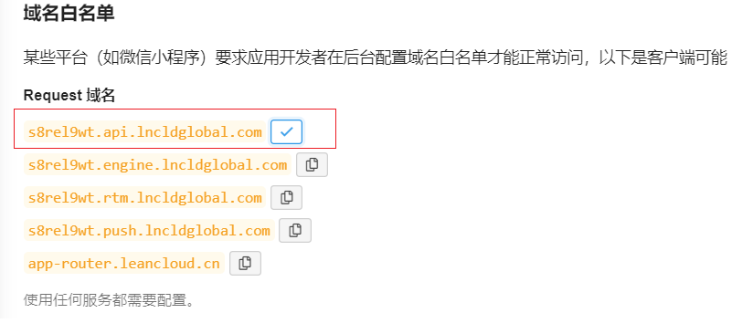
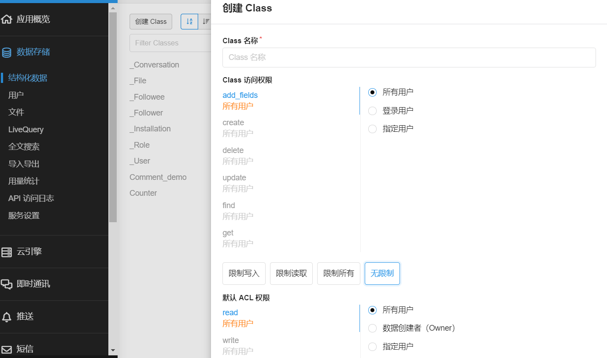
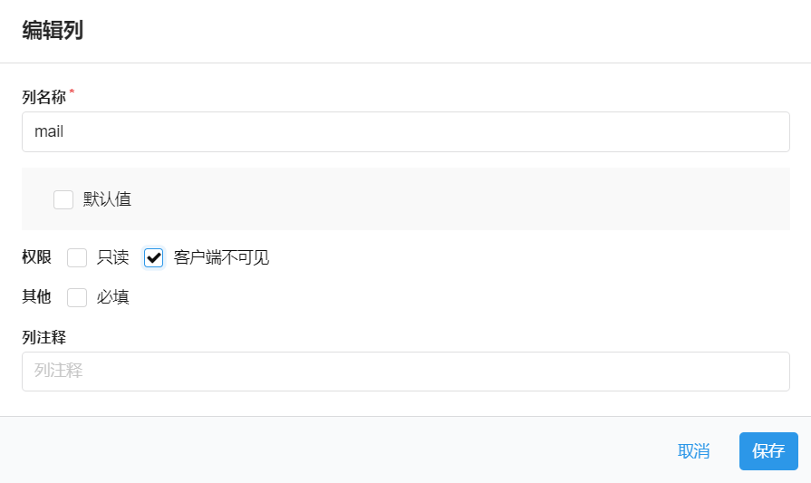
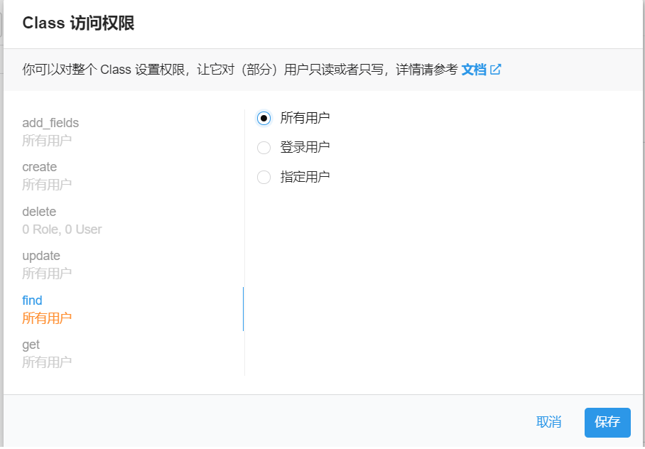

> 轻量级评论插件[Valine](https://github.com/xCss/Valine)的`React`版本。

[](https://travis-ci.org/stonehank/react-valine)
[](https://www.npmjs.com/package/react-valine)
[](https://codecov.io/gh/stonehank/react-valine)


---

### 特性

* 支持实时预览，支持`markdown`语法
* 表情输入，通过输入`:`开启表情选择框
* 头像自定义，用户可以选择头像(一共`8`种)，如果你填写的邮箱在[gravatar](http://gravatar.com)注册，那么将会获取你的头像加入到选项中。
* 支持编辑(使用`session/cookie`保存`token`)
* 嵌套和非嵌套的回复列表模式。
* 展示[评论数](#ValineCount)和[页面阅读量](#ValinePageview)统计组件，可以在任意位置调用。
* 精简大小(`gzip`后`50kb`)
* 可配置[邮件回复](#邮件回复)
* 多语言支持，支持自由扩展语言 

### 效果查看

[点击查看](https://stonehank.github.io/react-valine/)


### 待添加特性

- [x] 阅读量统计
- [x] 优化表情输入
- [x] 邮件回复
- [x] 多语言支持
- [x] 增加测试
- [X] 支持编辑
- [X] 替换`leancloud-sdk`，减少包大小
- [X] 替换三方UI，减少包大小
- [X] 支持`light`/`dark`主题
- [ ] 垃圾评论处理

### 使用说明

* 安装

`npm install react-valine`


### 组件说明：

####  Valine

创建`React.createContext`，并且传递`自定义参数`和储存当前`count`的组件(避免重复请求)。

参数：

|参数|是否必须|作用|默认值|
|:---:|:---:|:---:|:---:|
|appId|是|leancloud上的appId|/|
|appKey|是|leancloud上的appKey|/|
|serverURLs|否|LeanCloud的请求API([怎样获取](#获取serverURLs))|自动获取|
|requireName|否|是否必须填写昵称|true|
|requireEmail|否|是否必须填写邮箱|false|
|placeholder|否|评论框占位提示符|说点什么吧|
|nest|否|回复样式是否为嵌套模式|true|
|nestLayers|否|开启嵌套模式后有效，配置嵌套的层数|Infinity|
|editMode|否|开启可编辑模式，用户可以编辑自己的留言|false|
|pageSize|否|评论列表分页，每页条数|10|
|emojiListSize|否|输入`:`显示`emoji`的条数|5|
|sofaEmpty|否|无评论时显示|快来做第一个评论的人吧~|
|previewShow|否|是否默认开启实时预览|true|
|themeMode|否|设定全局主题(light/dark)|light|
|lang|否|支持中文(zh-cn)和英文(en)|zh-cn|
|CommentClass|否|在`leancloud`上存放**评论**的Class名称|Comment|
|CounterClass|否|在`leancloud`上存放**页面阅读量**的Class名称|Counter|
|customTxt|否|自定义内部文字|参考assets/locales.json|


案例参考：

index.js
```js
import React from 'react';
import ReactDOM from 'react-dom';
import {Valine} from "react-valine";
const appId='xxxxxxx-xxxx'
const appKey='xxxxxxxxx'

// 此处为全局导入，在App内部任意位置都可以使用<ValineCount />和<ValinePanel />
ReactDOM.render(
  <Valine  appId={appId}
           appKey={appKey}
           pagesize={12} 
           customTxt={
             {
               tips:{sofa:"抢个沙发吧~"},
               ctrl:{more:"再给我来一打"}
             }
           }>
    <App />
  </Valine>
  , document.getElementById('root'));
```

#### ValineCount

获取当前`uniqStr`的评论数。

参数：

|参数|是否必须|作用|默认值|
|:---:|:---:|:---:|:---:|
|[uniqStr](#关于uniqStr说明)|否|一个独立值，用于获取当前页面评论|window.location.origin+window.location.pathname|
|style|否|组件的样式|null|
|className|否|组件的样式类|''|
|count|否|未获取时的初始值|获取中|
|themeMode|否|设定当前模块主题|light|


案例参考：

articleMeta.js
```js
import React from 'react';
import {ValineCount} from "react-valine";

class ArticleMeta extends React.Component{
  render(){
    const {createdAt,author,a_unique_string}=this.props
    return (
      <div>
        <span>创建日期：{createdAt}</span>
        <span>作者：{author}</span>
        <span>评论数：<ValineCount uniqStr={a_unique_string}/></span>
      </div>
    )
  }
}
```

#### ValinePageview

阅读量统计组件。

参数：

|参数|是否必须|作用|默认值|
|:---:|:---:|:---:|:---:|
|[uniqStr](#关于uniqStr说明)|否|一个独立值，用于获取当前页面评论|window.location.origin+window.location.pathname|
|style|否|组件的样式|null|
|className|否|组件的样式类|''|
|count|否|未获取时的初始值|获取中|
|title|否|当前组件对应的文章标题，用于方便后台查看|document.title|
|themeMode|否|设定当前模块主题|light|


articleMeta.js
```js
import React from 'react';
import {ValineCount} from "react-valine";

class ArticleMeta extends React.Component{
  render(){
    const {createdAt,author,a_unique_string}=this.props
    return (
      <div>
        <span>创建日期：{createdAt}</span>
        <span>作者：{author}</span>
        <span>评论数：<ValineCount uniqStr={a_unique_string}/></span>
        <span>阅读量：<ValinePageview uniqStr={a_unique_string} title={"JS基础教程"} /></span>
      </div>
    )
  }
}
```

#### ValinePanel

评论面板，一般放在文章页最尾端。

参数：

|参数|是否必须|作用|默认值|
|:---:|:---:|:---:|:---:|
|[uniqStr](#关于uniqStr说明)|否|一个独立值，用于获取当前页面评论|window.location.origin+window.location.pathname|
|useWindow|否|配置执行滚动时所依赖的父元素|true|
|getPanelParent|否|`useWindow`为`false`时，可以自定义滚动父组件，默认滚动父组件为`panel.parentNode`|null|
|style|否|组件的样式|null|
|className|否|组件的样式类|''|
|themeMode|否|设定当前模块主题|light|


#### modify_hljs

一个自定义`highlight`的方法。

由于直接引入`highlight`文件体积过大，因此使用按需加载。

默认提供`js`和`java`的代码高亮显示。

案例参考：

增加`python`代码高亮。
```js
import {modify_hljs} from "react-valine";

modify_hljs((hljs)=>{
  const python = require('highlight.js/lib/languages/python');
  hljs.registerLanguage('python', python);
  return hljs
})

```

更多关于[异步加载highlight](https://highlightjs.org/usage/)的介绍。


### 关于uniqStr说明

每个页面的数据储存方式为`key:value`，因此每个页面有一个独立的字符串作为`key`，才能获取到页面的浏览数，评论数等数据，这个`key`称为`uniqStr`；

默认`uniqStr`使用当前页面`location.origin+location.pathname`，但是有一个缺陷，如果你在页面`b`想要获取页面`a`的评论数等数据，使用`location.origin+location.pathname`就会获取错误或者失败；

因此，对于每一个页面或者说每一个你定义的评论模块，建议手动提供一个`uniqStr`，这个`uniqStr`有以下特性：

1. 全局唯一
2. `uniqStr`对相同的页面一定有相同的值

例如：评论框位于文章后面

可以使用文章的独立`ID`作为`uniqStr`，这样做，你在任何页面都可以通过文章的`ID`来获取文章浏览量和评论数据。


> 注意：uniqStr必须是一个独立值，强烈建议自己填写一个独立值，而不是用默认值，因为如果使用默认值，当需要获取评论数时，并不一定在当前评论页的`uniqStr`上，就会获取错误或者失败。

### 客户端设置

1. ##### 获取APP ID 和 APP Key

    请先 [登录](https://leancloud.cn/dashboard/login.html#/signin) 或 
    [注册](https://leancloud.cn/dashboard/login.html#/signup) `LeanCloud`, 
    进入 [控制台](https://leancloud.cn/dashboard/applist.html#/apps) 
    后点击左下角 [创建应用](https://leancloud.cn/dashboard/applist.html#/newapp)
    
    
    
    应用创建好以后，进入刚刚创建的应用，选择左下角的`设置`>`应用Key`，然后就能看到你的`APP ID`和`APP Key`了：
    
    

2. ##### 获取serverURLs

    `serverURLs`在应用内部会尝试自动获取，如果发现获取失败，请手动提供
    刚刚创建的应用，选择左下角的`设置`>`应用Key`，找到`Request 域名` 第一行
    

3. ##### 创建 Comment 表
    在应用菜单->数据储存->结构化数据，点击`创建Class`，输入表名称`Comment`(也可以自定义)，自定义需要将名称传递给`react-valine`
    
    权限选择无限制，如图
    
    

4. ##### 配置 Comment 表
    在客户端 `Comment` 表中(也可能是你的自定义名称`CommentClass`)， 建议勾选 `mail`列的`客户端不可见`

    
    
5. ##### 配置 _User 表
    当你在`LeanCloud`客户端开启一个新的应用后，新创建的应用的 _User 表默认关闭了 find 权限，需要手动打开find权限，设置为`所有用户`

    

### 邮件回复

参考[Valine-Admin](https://github.com/zhaojun1998/Valine-Admin)


### Changelog

##### 0.6.0

* 打包时移除`console.log`

##### 0.5.9

* 修复多次更新`pageView`

##### 0.5.8

* 修复一些情况下无法显示部分css

##### 0.5.7

* 修复接收到`code:101`(当前请求对象不存在)时发生的逻辑崩溃，第一次发布评论时，自动创建`Comment`表
* 更新`README`, 添加客户端配置步骤
* **serverURLs**会尝试根据`appId`自动获取
* 修复多次点击造成多次请求问题

##### 0.5.5 (2020-3-23)
* 修复`at`某个人标签`class`被删除bug
* 更新package

##### 0.5.4 (2020-3-22)

* 分离数据获取模块
* 修复`xssFilter`过滤代码块的`class`，导致无高亮的bug
* 优化`webpack dev`显示

##### 0.5.3 (2020-3-21)

* 修复部分bug
* 增加测试，覆盖度超过90%

##### 0.5.2 (2020-3-16)

* 增加主题(黑暗/明亮)模式

* 修复提交后，`textarea`不能恢复高度的bug
* 修改自定义`leancloud`上储存**评论**的Class默认名称为`"Comment"`(兼容之前版本和邮件回复功能)
* 增加自定义`leancloud`上储存**页面阅读量**的Class名称，默认为`"Counter"`

[更多Changelog](https://github.com/stonehank/react-valine/blob/master/CHANGELOG.md)
